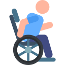
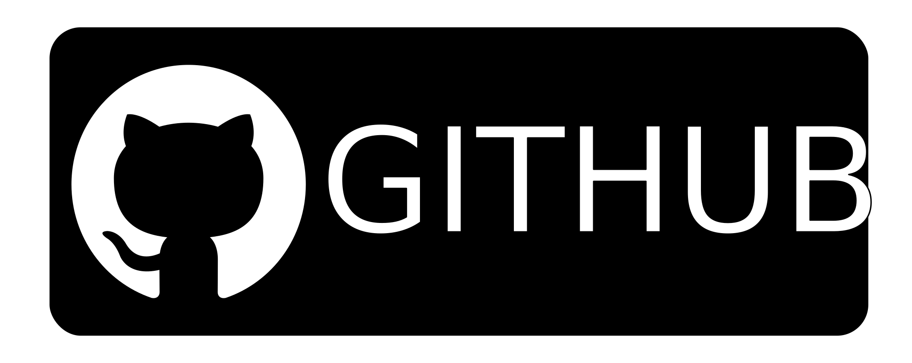

# Projeto Integrador - Site Acessuratio

## Objetivo

Nosso site tem por objetivo ajudar pessoas com deficiência a encontrar estabelecimentos que possam lhes proporcionar conforto e independência. Também almejamos contribuir para a divulgação de estabelecimentos acessíveis, para que estes possam atrair clientes com necessidades especiais. Dessa forma, podemos incentivar que mais e mais empresas e estabelecimentos adotem a acessibilidade.

## Situação Exemplo

Recentemente, Pedro sofreu um acidente que imobilizou suas pernas. Além do impacto de necessitar de uma cadeira de rodas para se locomover, ele precisa lidar com as dificuldades que sua nova realidade traz no dia a dia, como por exemplo acessar o seu apartamento no 5ª andar, ou subir uma escada de 3 andares para entrar em um restaurante.

Navegando na internet, Pedro vê uma publicação no Instagram sobre espaços acessíveis. Ele então acessa o link, eg é levado para um site que exibe diversos locais que estão preparados para proporcionar o que ele tanto desejava, um lugares onde ele não precisaria pedir a ninguém uma "ajudinha".

|                                   Desenvolvedores                                    | Nomes             |                                                             Github                                                              |                                                                             Linkedin                                                                              |
| :----------------------------------------------------------------------------------: | ----------------- | :-----------------------------------------------------------------------------------------------------------------------------: | :---------------------------------------------------------------------------------------------------------------------------------------------------------------: |
|         | David Shelton     |   |                        |
|   | Douglas Gabriel   |     |   |
|   | Elisângela Rosa   |  |  |
|  | Isabella Flauzino |  |                  |

### _Icones_

[SVGREPO](https://www.svgrepo.com/)

[Cadeira-de-rodas ícones criados por Freepik - Flaticon](https://www.flaticon.com/br/icones-gratis/cadeira-de-rodas)
